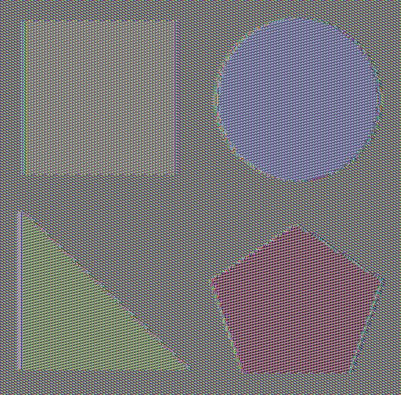

# AES-128 (ECB Mode) Implementation from Scratch

This repository contains a fully functional, scratch-built implementation of the **Advanced Encryption Standard (AES-128)** in Python. The cipher operates in the **Electronic Codebook (ECB)** mode.

The primary goal of this project is to demonstrate the mathematical foundations of AES (Galois Field arithmetic, state matrices, transformations) and to visually expose the critical security flaw of using ECB mode for highly structured data.

## ⚠️ The ECB Mode Vulnerability (Visual Proof)

In ECB mode, identical plaintext blocks (e.g., pixels of the same color) are encrypted into identical ciphertext blocks. Because of this deterministic nature, data patterns are perfectly preserved after encryption. 

To demonstrate this, I used my AES implementation to encrypt an image. While the colors and raw byte values are completely scrambled, **the original shapes remain clearly visible**:

| Original Image | Encrypted Image (ECB Mode) |
| :---: | :---: |
|  |  |

*This phenomenon (often referred to in cryptography as the "ECB Penguin") is the exact reason why ECB mode is considered insecure for real-world applications and why modes like CBC (Cipher Block Chaining) or GCM (Galois/Counter Mode) are used instead.*

## 🚀 Key Features

* **Zero Cryptography Libraries:** The entire AES algorithm was written from scratch, relying only on basic Python data structures.
* **Galois Field Math:** Custom implementations of GF(2^8) arithmetic, including bitwise XOR operations and modulo reduction using the irreducible polynomial `x^8 + x^4 + x^3 + x + 1`.
* **AES Core Transformations:** Fully functioning `SubBytes`, `ShiftRows`, `MixColumns`, and `AddRoundKey` (along with their inverse operations for decryption).
* **Key Expansion:** Generates the required 44 word (176 byte) key schedule from a single 16-byte master key.
* **PKCS#7 Padding:** Ensures data of any length is properly padded before encryption and securely stripped after decryption.
* **Binary & Image Processing:** Encrypts raw `.txt` files as well as binary image data using `Pillow`.

## 📁 Repository Structure

```text
AES-128-ECB/
│
├── AES_128_ECB.ipynb          # Main Jupyter Notebook with code, tests, and explanations
├── requirements.txt           # Python dependencies (Pillow, Jupyter)
├── README.md                  # Project documentation
│
├── data/                      # Sample files used during script execution
│   ├── TEST.txt               
│   └── TEST_IMG2.jpeg         
│
└── assets/                    # Images used for this README presentation
    ├── original_preview.jpg   
    └── encrypted_preview.jpg  
```

## 🛠️ Installation & Usage

1. **Clone the repository:**
   ```bash
   git clone [https://github.com/YourUsername/AES-128-ECB.git](https://github.com/YourUsername/AES-128-ECB.git)
   cd AES-128-ECB
   ```

2. **Install the required dependencies:**
   ```bash
   pip install -r requirements.txt
   ```

3. **Launch Jupyter Notebook:**
   ```bash
   jupyter notebook
   ```
   Open `AES_128_ECB.ipynb` and run the cells to see the math in action, encrypt files, and reproduce the image encryption vulnerability yourself!

## 🧠 What I Learned
Building this project allowed me to translate theoretical cryptographic knowledge into practical programming. It heavily improved my understanding of **block ciphers**, **linear algebra applied to cryptography**, and **secure memory/data handling**. It also reinforced the importance of choosing the correct cryptographic modes of operation during application development.
